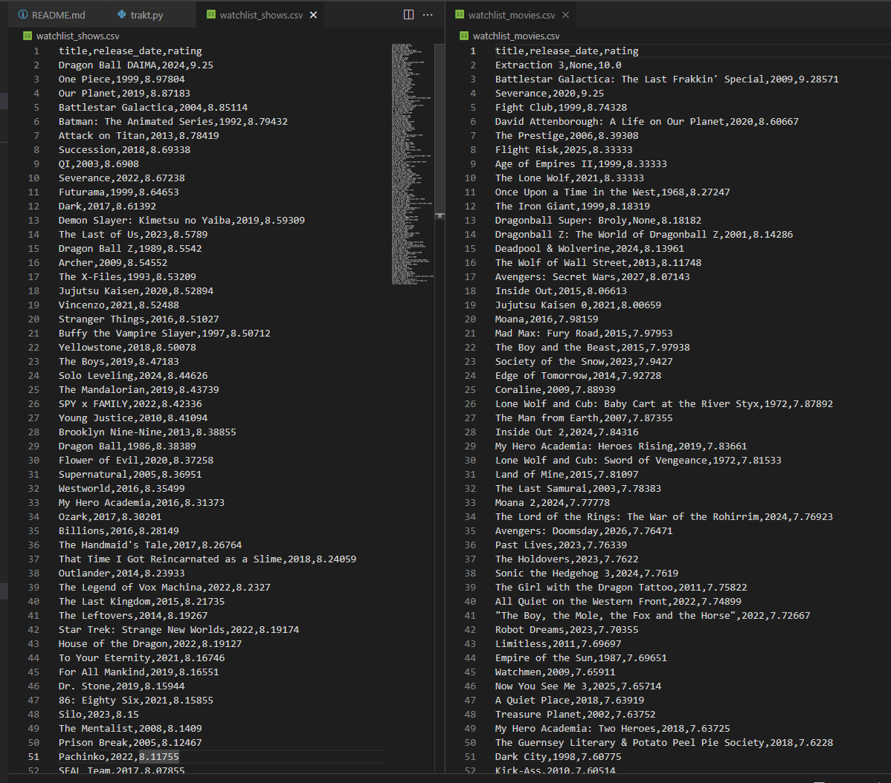

# trakt-csv-exporter

`trakt-csv-exporter` is a Python script that uses the Trakt API to fetch and export a user's watchlist and completed shows and movies to CSV files. This tool helps users track their media progress and organize their data in an easily accessible format.

## Features

- Fetches watched and watchlist shows from Trakt.
- Identifies in-progress shows by filtering out completed ones.
- Exports in-progress and watchlist shows to a CSV file (`watchlist_shows.csv`).
- Exports completed shows to a separate CSV file (`watched_shows.csv`).
- Fetches watched and watchlist movies from Trakt.
- Exports watched and watchlist movies to separate CSV files (`watched_movies.csv`, `watchlist_movies.csv`).

## Example



## Setup

1. Clone the repository:
    ```bash
    git clone https://github.com/your-username/trakt-csv-exporter.git
    cd trakt-csv-exporter
    ```

2. Install dependencies:
    ```bash
    pip install -r requirements.txt
    ```

## Environment Setup

Before running the script, you'll need to configure the necessary environment variables to authenticate with the Trakt API. Create a `.env` file in the root of the project (next to the `scripts` folder) with the following content:

```bash
TRAKT_CLIENT_ID=your_client_id
TRAKT_CLIENT_SECRET=your_client_secret
TRAKT_AUTHORISATION_CODE=your_authorisation_code
TRAKT_REDIRECT_URI=urn:ietf:wg:oauth:2.0:oob
TRAKT_ACCESS_TOKEN=your_access_token
```

### Steps to Obtain Trakt API Credentials

1. Go to [trakt.tv](https://trakt.tv/) and log in.
2. Navigate to **Settings** > **Your API Apps**.
3. Add a **New Application** to get your `TRAKT_CLIENT_ID` and `TRAKT_CLIENT_SECRET`.
4. Set the **Redirect URI** as `urn:ietf:wg:oauth:2.0:oob`.
5. After creating the application, you'll receive the `CLIENT_ID` and `CLIENT_SECRET` needed for the `.env` file.
6. Use the `trakt_get_access_token.py` script to generate your `TRAKT_ACCESS_TOKEN` using your environment variables.

### Getting an Access Token

You need to run the `trakt_get_access_token.py` script to obtain your personal access token. This token will allow the script to access your Trakt account data. Make sure your environment variables (from the `.env` file) are set correctly before running this script.

## Usage

To run the script and generate the CSVs:

```bash
python -m scripts.trakt
```

This will generate four CSV files:

- `watchlist_shows.csv`: A list of shows in your watchlist or in-progress.
- `watched_shows.csv`: A list of shows you've completed.
- `watchlist_movies.csv`: A list of movies in your watchlist.
- `watched_movies.csv`: A list of movies you've completed.

## Testing

Test scripts are located in the `scripts/tests` folder. To run the tests, use:

```bash
python -m scripts.tests.fetch_movie_ratings
```

Replace fetch_movie_ratings with the relevant test script you want to run.

## Contributing

Feel free to open issues or pull requests if you'd like to contribute!

## License

This project is licensed under the MIT License - see the LICENSE file for details.